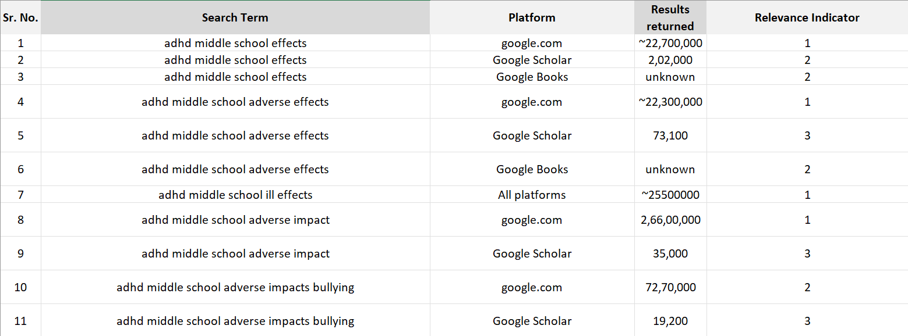
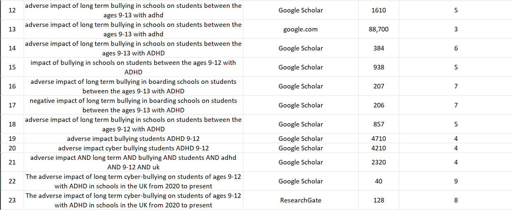
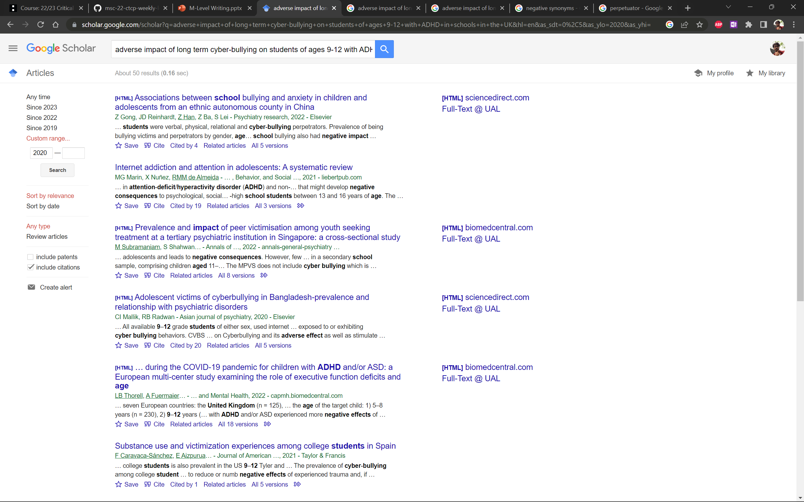

# Assignment 1
(Conducting literature search)      
    
        
        

**Aim**
The aim of the first assignment was to practise conducting a preliminary online search of relevant material following the choosing of an area of focus. Further, we were to document the process of searching and collecting relevant material using strategies laid out in the book: Newing, H. (2010). Conducting Research in Conservation: Social Science Methods and Practice. United Kingdom: Taylor & Francis.    

**Identifying a Research Topic**    
The first thing I considered when trying to identify a research topic was positionality. As a person with a history of the learning disability ADHD through my middle school years, I decided it would be best for me to conduct research along the lines. Recollecting from personal memory, I decided an interesting avenue of research would be to conduct a study on the effects and relationship of ADHD in middle school children (ages 9-13) with social developmental issues such as anxiety, depression, and bullying. Since this was a fairly broad scope research subject, I decided to start off by looking at literature along these lines and then narrowing it down to a smaller scope.   

**Phase 1**   
In the first phase, I conducted broad scope searches using google.com, Google Scholar and Google Books. The search terms yielded a large amount of results. While the results were a good introductory point, I knew i had to narrow down research scope and hence the search terms. Studying effects as a whole would yield a seemingly infinite number of resources. So i decided to narrow down the scope by choosing to focus on the adverse effects. I searches by adding keywords such as 'adverse', 'negative', and 'ill-effects' (most commonly used synonyms in this context, according to my own judgement). The search terms still yielded far too many results, especially google.com given it provides one with media of all kind. The results of phase 1 are documented in the table below.     
Following an intriduction to the ill-effects, I decided to narrow down the results further by filtering out specific effects. I decided it made sense to find literature for specific causes of the ill-effects rather than the effects themselves i.e. 'bullying', 'insecurity', etc. I chose to focus on the relationship between ADHD and bullying, searching for 'bullying' as a part of the search term specifically agnostic to mentions of other terms such as 'social anxiety', 'depression', 'development', and 'growth'. In order to capture the essence of what I was trying to find, I decided to include the keyword 'impact' in my searches too.   

       

  
**Phase 2**
I had identified keywords that worked for me: 'adhd', 'impacts', 'adverse', middle school', and 'bullying'. In Phase 2 of the literature search, I decided to dig deeper into each to narrow down the scope by answering a few questions to myself. Some examples were:
- What is middle school? Can I define it as a more specific range?
- Can I use the search term 'students' instead of children?
- Can I study only the correlation between bullying and ADHD within the scope of 'social anxiety and development' for example?
- 'Bullying' is a general term. Can I study the effects of smaller categories within bullying - Long/Short term, mental/physical acts of bullying, cyber bullying vs. bullying in physical environments, etc.?
- Would the adverse effects shown different trends when filtered by the gender identity of the perpetrator and/or the victim? Could I choose to study a smaller scope within the same?

I finally landed on studying the 'adverse impact of long term bullying in schools on students between the ages 9-13 with ADHD'. The searches yielded far fewer results, but still too large to commit as the scope of a literature review for a hypothetical 3000 word essay. The results are captured below:   
   
   

**Phase 3**
While Phase 2 improved on narrowing the scope furthewr, it was immediately clear that a lot of work had been done within the scope and to study it would be to try to reinvent the wheel (with limited research experience to back up the act of doing so). Hence, I decide to narrow it down further based on learning from some of the resluts in Phase 2 that I had gone through. Some of the questions I asked myself were:
- How would the impacts differ in a day school vs. a boarding school.
- Would the impacts be measurably different when dealing with students from differing demographic groups? How would it affect students who are people of colour, or from less fortunate economic background differently?
- How would the impact be measurably different if a student is a a victim of other disabilities (Dyslexia, physical imapirments)?
- How would the results far when filtered by geography?
- Could the impacts be different based on the time frame considered? For example, students in the previous 3 years would be far likely to be susceptible to cyber-bullying than students in the early 2010s
- Was 9-13 the most relevant age range? Do cognitive development and growth studies ascertain a different age range that is more relevant to being grouped and studying?

I landed on the search scope of 'The adverse impact of long term cyber-bullying on students of ages 9-12 with ADHD in schools in the UK from 2020 to present'
By this point, I had dropped Google.com as a source. Instead, I used Google Scholar, ResearchGate, Academia.edu, the CCI Library, etc. at Phase 3 to look for results. I found varying amounts of success with each using truncation and Boolean operations to land my result, with Google Scholar providing the largest number and the most relevant results consistently accross search terms.

**Phase 4**
At this point, I believed the scope had been narrowed and set appropriately. The final step was to use my own judgement to filter results out. The following is a screenshot result of the search term from Phase 3 yielding 50 results on Google Scholar, but with varying levels of relevance:     

   

     
After filtering out the search terms by myself, in the last phase, I arrived at a sum total of 23 pieces of literature to review within my scope of study. The final search term which would probably translate in some respect to the title of any resultant study would be:

    
The Impact of Long-Term Cyber-Bullying on Students of ages 9-12 with ADHD in the United Kingdom since 2020.    
---
